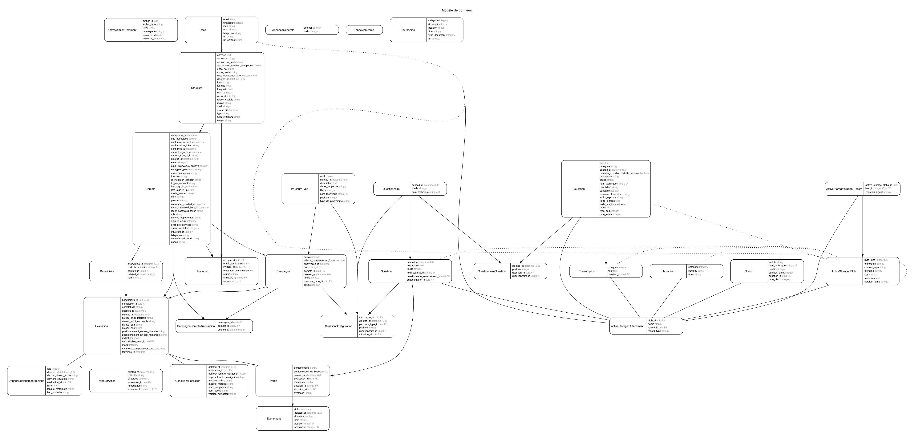

# Serveur eva

Cette application sert de serveur et d'espace d'administration pour eva

Pour voir les autres projets de eva :

- [la partie cliente](https://github.com/betagouv/eva)
- [Metabase](https://github.com/betagouv/eva-metabase)

Anciens dépôts que nous n'utilisons plus aujourd'hui :

- [la partie orchestration](https://github.com/betagouv/eva-orchestrateur)
- [le site web](https://github.com/betagouv/eva-www)

Autre dépendences :

* Base de données et assimilé  
PostgreSql
Redis

## Initialisation de l'environnement de developpement

```
bundle install
npm install
```

### Dépendences système pour le developpement

#### vips
Le redimentionnement des images est dépendant d'une librairie système : vips

voir [libvips install instructions](https://www.libvips.org/install.html)

#### GraphViz's

Pour la génération du graphique de la structure de la base avec erd

https://graphviz.org/download/

### Création de la base  
`rake db:create`

### Initialisation de la base  
`rake db:migrate` && `rake db:seed`

Avant de pouvoir commencer des tests utilisateurs, il vous faut créer une campagne avec l'interface d'administration décrite ci-dessous.

**Note :** Si vous avez utilisé la base de donnée de preprod, vous devez supprimer (localement) les assets afin de pouvoir lancer le jeu en local à l'aide de la commande : `rake active_storage:destroy_attachments`

### Lancer les tests
`bundle exec rake spec` ou `guard`

### Lancer le lint CSS/SCSS

Le projet utilise `stylelint` pour vérifier les fichiers SCSS sous `app/assets/stylesheets`.

Commandes :

```bash
# Vérifier les erreurs
npm run lint:css

# Corriger automatiquement les erreurs corrigeables
npm run lint:css:fix
```

Règle importante : **il est interdit d’utiliser des valeurs en `px` pour les propriétés `margin`, `margin-*`, `padding` et `padding-*`**.  
Utiliser à la place les variables de spacing existantes (en `rem` ou issues du DSFR).

### Espace d'administration
accessible à l'url `/admin`, un compte admin est créé avec l'execution du seed. À ce jour le compte créé est `administrateur@exemple.com` avec le mot de passe `password` (pour le développement seulement bien sûr ;-))

### Variables d'environnement

- Copier-coller le fichier `.env.template` vers `.env` : `cp .env.template .env`

Sans les variables, le projet ne se lancera pas correctement en local.
<SECRET_METABASE> se trouve sur metabase https://metabase.eva.anlci.gouv.fr/admin/settings/embedding-in-other-applications/standalone
Demander le <SECRET_IC> à l'équipe

## API

L'api est accessible au point `/api`

### Crée une évaluation

**Requête**

`POST /api/evaluations`

```json
{
  "nom": "Roger",
  "code_campagne": "Mon code de campagne",
  "debutee_le": "2021-10-03T22:15:24+0000",
  "terminee_le": "2021-10-03T22:25:24+0000"
}
```

**Réponse**

```json
{
  "campagne_id": "09209dea-0fa7-40ea-aba8-cbadc1957f4d",
  "created_at": "2021-10-08T09:27:09.754+02:00",
  "id": "51b4b749-7ac2-40b4-b8f8-b8c9e5663c69",
  "nom": "Roger",
  "debutee_le": "2021-10-03T22:15:24.000+02:00",
  "terminee_le": "2021-10-03T22:25:24.000+02:00",
  "updated_at": "2021-10-08T09:27:09.754+02:00"
}
```

### Mettre à jour une évaluation

**Requête**

`PATCH /api/evaluations/:id`

```json
{
  "terminee_le":"2021-10-03T22:15:24+02:00"
  "age":"23",
  "genre":"Femme",
  "dernier_niveau_etude":"Niveau Collège",
  "derniere_situation":"Alternance"
}
```

**Réponse**

```json
{
  "campagne_id": "09209dea-0fa7-40ea-aba8-cbadc1957f4d",
  "created_at": "2021-10-03T20:51:18.490+02:00",
  "id": "569cdc17-554d-4227-acfe-1d5d3a4afdbc",
  "nom": "Roger",
  "terminee_le": "2021-10-06T16:13:24.000+02:00",
  "updated_at": "2021-10-08T09:16:38.943+02:00",
  "age":"23",
  "genre":"Femme",
  "dernier_niveau_etude":"Niveau Collège",
  "derniere_situation":"Alternance"
}
```

### Annonce la fin de l'évaluation

`POST /api/evaluations/:id/fin`

```json
{
  "terminee_le":"2021-10-03T22:15:24+02:00"
}
```

**Réponse**

```json
{
  "competences_fortes": [
    {
      "nom_technique": "id_competence",
      "nom": "nom_competence",
      "description": "Description de la compétence.",
      "picto": "http://host/assets/competence.svg"
    }
  ]
}
```

### Récupére des informations sur un questionnaire

**Requête**

`GET /api/questionnaires/:id`

**Réponse**

Retourne un tableau de questions. Les champs retournés dépendent du type de question.

#### Champs audio communs à tous les types

| Champ | Description |
|-------|-------------|
| `audio_url` | URL de l'audio principal (intitulé si complet, sinon modalité de réponse) |
| `consigne_audio` | URL de l'audio de la consigne |
| `intitule_audio` | URL de l'audio de l'intitulé (uniquement si l'intitulé n'est pas complet) |

#### Type `qcm`

```json
{
  "id": "d5e892ff-6747-4e21-ad60-2f3255ffb314",
  "type": "qcm",
  "nom_technique": "N1Pse1",
  "type_qcm": "standard",
  "intitule": "Ma question",
  "description": "Ma description",
  "modalite_reponse": "Sélectionnez une réponse",
  "illustration": "https://example.com/image.jpg",
  "metacompetence": "numeratie",
  "score": 1,
  "passable": true,
  "demarrage_audio_modalite_reponse": false,
  "audio_url": "https://example.com/audio.mp3",
  "consigne_audio": "https://example.com/consigne.mp3",
  "choix": [
    {
      "id": "a1b2c3d4-...",
      "nom_technique": "N1Pse1R1",
      "intitule": "Réponse 1",
      "type_choix": "bon",
      "position": 1,
      "audio_url": "https://example.com/choix.mp3"
    }
  ]
}
```

| Champ | Description |
|-------|-------------|
| `type_qcm` | Type de QCM : `standard` ou `jauge` |
| `choix` | Tableau des choix de réponses |
| `choix[].type_choix` | Type du choix : `bon` ou `mauvais` |

#### Type `saisie`

```json
{
  "id": "d5e892ff-6747-4e21-ad60-2f3255ffb314",
  "type": "saisie",
  "nom_technique": "N1Pse2",
  "sous_type": "numerique",
  "intitule": "Ma question",
  "description": "Ma description",
  "modalite_reponse": "Entrez votre réponse",
  "illustration": "https://example.com/image.jpg",
  "metacompetence": "numeratie",
  "score": 1,
  "passable": true,
  "demarrage_audio_modalite_reponse": false,
  "placeholder": "0,00",
  "suffix_reponse": "€",
  "aide": "Aide contextuelle",
  "texte_a_trous": null,
  "max_length": 6,
  "audio_url": "https://example.com/audio.mp3",
  "reponses": [
    {
      "nom_technique": "N1Pse2R1",
      "intitule": "42",
      "type_choix": "bon"
    }
  ]
}
```

| Champ | Description |
|-------|-------------|
| `sous_type` | Type de saisie : `redaction`, `numerique`, `texte`, `nombre_avec_virgule` |
| `placeholder` | Texte indicatif dans le champ de saisie |
| `suffix_reponse` | Suffixe affiché après la réponse (ex: €, kg) |
| `texte_a_trous` | Texte avec des trous à compléter |
| `max_length` | Longueur maximale de la saisie (6 pour `nombre_avec_virgule`) |
| `reponses` | Tableau des réponses attendues |

#### Type `clic-dans-image`

```json
{
  "id": "d5e892ff-6747-4e21-ad60-2f3255ffb314",
  "type": "clic-dans-image",
  "nom_technique": "N1Pse3",
  "intitule": "Ma question",
  "description": "Ma description",
  "modalite_reponse": "Cliquez sur la bonne zone",
  "illustration": "https://example.com/image.jpg",
  "zone_cliquable_url": "https://example.com/zone.svg",
  "image_au_clic_url": "https://example.com/feedback.svg",
  "metacompetence": "numeratie",
  "score": 1,
  "passable": true,
  "demarrage_audio_modalite_reponse": false,
  "audio_url": "https://example.com/audio.mp3"
}
```

| Champ | Description |
|-------|-------------|
| `zone_cliquable_url` | URL du SVG contenant les zones cliquables (avec classe `bonne-reponse`) |
| `image_au_clic_url` | URL du SVG affiché après le clic |

#### Type `clic-sur-mots`

```json
{
  "id": "d5e892ff-6747-4e21-ad60-2f3255ffb314",
  "type": "clic-sur-mots",
  "nom_technique": "N1Pse4",
  "intitule": "Ma question",
  "description": "Ma description",
  "modalite_reponse": "Cliquez sur les mots corrects",
  "illustration": "https://example.com/image.jpg",
  "texte_cliquable": "Le [mot1](#bonne-reponse) est correct",
  "reponse": {
    "bonne_reponse": ["mot1", "mot2"]
  },
  "metacompetence": "litteratie",
  "score": 1,
  "passable": true,
  "demarrage_audio_modalite_reponse": false,
  "audio_url": "https://example.com/audio.mp3"
}
```

| Champ | Description |
|-------|-------------|
| `texte_cliquable` | Texte en markdown avec les mots cliquables marqués `[mot](#bonne-reponse)` |
| `reponse.bonne_reponse` | Tableau des mots considérés comme bonnes réponses |

#### Type `glisser-deposer`

```json
{
  "id": "d5e892ff-6747-4e21-ad60-2f3255ffb314",
  "type": "glisser-deposer",
  "nom_technique": "N1Pse5",
  "intitule": "Ma question",
  "description": "Ma description",
  "modalite_reponse": "Glissez les éléments",
  "illustration": "https://example.com/image.jpg",
  "zone_depot_url": "https://example.com/zones.svg",
  "orientation": "horizontal",
  "metacompetence": "numeratie",
  "score": 1,
  "passable": true,
  "demarrage_audio_modalite_reponse": false,
  "audio_url": "https://example.com/audio.mp3",
  "reponsesNonClassees": [
    {
      "id": "a1b2c3d4-...",
      "nom_technique": "N1Pse5R1",
      "intitule": "Élément 1",
      "position": 1,
      "position_client": "zone-depot--N1Pse5R1",
      "illustration": "https://example.com/element.jpg"
    }
  ]
}
```

| Champ | Description |
|-------|-------------|
| `zone_depot_url` | URL du SVG contenant les zones de dépôt (avec classes `zone-depot zone-depot--{nom_technique}`) |
| `orientation` | Orientation des éléments : `vertical` ou `horizontal` |
| `reponsesNonClassees` | Tableau des éléments à glisser-déposer |
| `reponsesNonClassees[].position_client` | Position cible de l'élément |

### Crée un événement

`POST /api/evenements`

Contenu:

```json
{
  "date": 1551111089238,
  "nom": "ouvertureContenant",
  "session_id": "baf2c86c-6c34-11e9-901c-c34362f7423a",
  "situation": "inventaire",
  "donnees": {"idContenu": "6"},
  "evaluation_id": "1",
}
```

### Crée une collection d'événements

`POST /api/evaluations/:evaluation_id/collections_evenements`

Contenu:

```json
{
  "evenements": [
    {
      "date":1632317532817,
      "session_id":"54af3010-315c-4755-b268-08c4bf520f64",
      "situation":"bienvenue",
      "nom":"reponse",
      "donnees": {
        "question":"f728be21-6f19-4901-ba07-0ac26ad702d7",
        "reponse":"5f5ce41c-a2f0-4512-b266-39a4945dbeba"
      },
      "evaluation_id":"b80e3b14-737e-4712-a2ff-3f22f5bdcd4d",
      "position": 2
    },
    // ...
  ]
}
```

### Récupére des informations sur une campagne

**Requête**

`GET /api/campagnes/:code_campagne`

**Réponse**

```json
{
  "libelle": "Ma campagne",
  "code": "FRT61000",
  "questions:": [],
  "situations": [
    {
      "id": "569cdc17-554d-4227-acfe-1d5d3a4afdbc",
      "libelle": "Tri",
      "nom_technique": "tri",
      "nom_technique_sans_variant": "tri",
      "questionnaire_id": "f958d99d-4adb-455b-8d85-c7e89ab7025c",
      "questions:": [
        {
          "id": "d5e892ff-6747-4e21-ad60-2f3255ffb314",
          "type": "qcm",
          "intitule": "Ma question",
          "nom_technique": "ma-question",
          "illustration": "https://stockagepreprod.eva.anlci.gouv.fr/7yii4m9m7t7bjvl42z7qmofuie7w?filename=bienvenue_background.jpg",
          "description": "Ma description",
          "choix": []
        }
      ],
      "questionnaire_entrainement_id": "f958d99d-4adb-455b-8d85-c7e89ab7025c",
      "questions_entrainement": [
        {
          "id": "d5e892ff-6747-4e21-ad60-2f3255ffb314",
          "type": "qcm",
          "intitule": "Ma question",
          "nom_technique": "ma-question",
          "illustration": "https://stockagepreprod.eva.anlci.gouv.fr/7yii4m9m7t7bjvl42z7qmofuie7w?filename=bienvenue_background.jpg",
          "description": "Ma description",
          "choix": []
        }
      ]
    }
  ]
}
```

## Géolocalisation

Nous utilisons plusieurs services de géolocalisation :
* Nominatim (openstreetmap) pour la doc chercher Nominatim dans cette page https://github.com/alexreisner/geocoder/blob/master/README_API_GUIDE.md
* geo.api.gouv.fr/communes (https://api.gouv.fr/les-api/api-geo)
* geo.api.gouv.fr/departements (https://api.gouv.fr/les-api/api-geo)

Le premier service est utilisé pour rechercher la position GPS du code postal
d'une structure, le second service pour valider les codes postaux et rechercher
leurs informations au moment de la recherche de structure par code postal.
Les deux derniers services sont utilisés pour retrouver la region.


## Structure des données

Un graphique de la structure de la base peut être généré afin de mieux comprendre les intérractions entre les différents modèles.



Pour générer ce graphique:
- installer la dépendence GraphViz's (voir ci-dessus)

`bundle exec rake erd`

## Licence

Ce logiciel et son code source sont distribués sous [licence AGPL](https://www.gnu.org/licenses/why-affero-gpl.fr.html).
