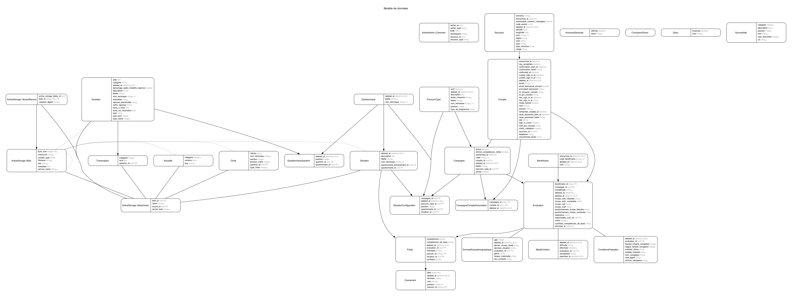

# Serveur eva

Cette application sert de serveur et d'espace d'administration pour eva

Pour voir les autres projets de eva :

- [la partie cliente](https://github.com/betagouv/eva)
- [la partie orchestration](https://github.com/betagouv/eva-orchestrateur)
- [le site web](https://github.com/betagouv/eva-www)

* Ruby version  
2.6

* Base de données et assimilé  
PostgreSql
Redis

* Création de la base  
`rake db:create`

* Initialisation de la base  
`rake db:migrate` && `rake db:seed`

Avant de pouvoir commencer des tests utilisateurs, il vous faut créer une campagne avec l'interface d'administration décrite ci-dessous.

* Lancer les tests
`bundle exec rake spec` ou `guard`

* Espace d'administration
accessible à l'url `/admin`, un compte admin est créé avec l'execution du seed. À ce jour le compte créé est `administrateur@exemple.com` avec le mot de passe `password` (pour le développement seulement bien sûr ;-))

## API

L'api est accessible au point `/api`

### Crée une évaluation

**Requête**

`POST /api/evaluations`

```
{
  "nom": "Roger",
  "code_campagne": "Mon code de campagne"
}
```

**Réponse**

```
{
  "id:": 1,
  "nom": "Roger"
}
```

### Récupére des informations sur l'évaluation

**Requête**

`GET /api/evaluations/:id`

**Réponse**

```
{
  "questions:": [
    {
      id: 1,
      type: 'qcm',
      intitule: 'Ma question',
      description: 'Ma description',
      choix: []
    }
  ],
  "situations": [
    {
      "id": 1,
      "libelle": "Tri",
      "nom_technique": "tri"
    }
  ]
}
```

### Annonce la fin de l'évaluation

`POST /api/evaluations/:id/fin`

**Réponse**

```
{
  "competences_fortes": [
    {
      "id": "id_competence",
      "nom": "nom_competence",
      "description": "Description de la compétence.",
      "picto": "http://host/assets/competence.svg"
    }
  ]
}
```

### Récupére des informations sur un questionnaire

**Requête**

`GET /api/questionnaires/:id`

**Réponse**

```
[
  {
    id: 1,
    type: 'qcm',
    intitule: 'Ma question',
    description: 'Ma description',
    choix: []
  }
]
```

### Crée un événement

`POST /api/evenements`

Contenu:

```
{
  "date": 1551111089238,
  "nom": "ouvertureContenant",
  "session_id": "baf2c86c-6c34-11e9-901c-c34362f7423a",
  "situation": "inventaire",
  "donnees": {"idContenu": "6"},
  "evaluation_id": "1",
}
```


### Récupére des informations sur une campagne

**Requête**

`GET /api/campagnes/:code_campagne`

**Réponse**

```
{
  "questions:": [
    {
      id: 1,
      type: 'qcm',
      intitule: 'Ma question',
      description: 'Ma description',
      choix: []
    }
  ],
  "situations": [
    {
      "id": 1,
      "libelle": "Tri",
      "nom_technique": "tri"
    }
  ]
}
```

## Modèle de données




Pour générer ce graphique:
  1. `bundle exec rake erd filetype=dot orientation=vertical attributes=foreign_keys,content,timestamps`
  2. `dot -Tpng erd.dot -o docs/erd.png`

## Licence

Ce logiciel et son code source sont distribués sous [licence AGPL](https://www.gnu.org/licenses/why-affero-gpl.fr.html).
