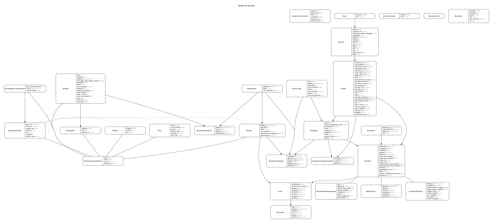

# Serveur eva

Cette application sert de serveur et d'espace d'administration pour eva

Pour voir les autres projets de eva :

- [la partie cliente](https://github.com/betagouv/eva)
- [Metabase](https://github.com/betagouv/eva-metabase)

Anciens dépôts que nous n'utilisons plus aujourd'hui :

- [la partie orchestration](https://github.com/betagouv/eva-orchestrateur)
- [le site web](https://github.com/betagouv/eva-www)

Autre dépendences :

* Base de données et assimilé  
PostgreSql
Redis

## Initialisation de l'environnement de developpement

```
bundle install
npm install
```

### Création de la base  
`rake db:create`

### Initialisation de la base  
`rake db:migrate` && `rake db:seed`

Avant de pouvoir commencer des tests utilisateurs, il vous faut créer une campagne avec l'interface d'administration décrite ci-dessous.

### Lancer les tests
`bundle exec rake spec` ou `guard`

### Lancer storybook en développement  

Générer le fichier de description des composants :  
`bundle exec rake view_component_storybook:write_stories_json`
 # Storybook

Pour démarrer storybook (votre serveur rails doit être démarré) :
```
npm run storybook
```

Pour générer des nouvelles stories :
```
rake view_component_storybook:write_stories_json
```

### Espace d'administration
accessible à l'url `/admin`, un compte admin est créé avec l'execution du seed. À ce jour le compte créé est `administrateur@exemple.com` avec le mot de passe `password` (pour le développement seulement bien sûr ;-))

### Variables d'environnement
```
PROTOCOLE_SERVEUR=http
HOTE_SERVEUR=localhost:3000
URL_CLIENT=http://localhost:7700/jeu
EMAIL_DEFAULT_FROM=eva@beta.gouv.fr
METABASE_SITE_URL=http://metabase.eva.beta.gouv.fr
METABASE_SECRET_KEY=<SECRET_METABASE>
PRO_CONNECT_CLIENT_ID=<client_id_Pro_connect>
PRO_CONNECT_CLIENT_SECRET=<SECRET_PROCONNECT>
PRO_CONNECT_BASE_URL=https://fca.integ01.dev-agentconnect.fr
```
Sans ces variables, le projet ne se lancera pas correctement en local.
<SECRET_METABASE> se trouve sur metabase https://metabase.eva.beta.gouv.fr/admin/settings/embedding-in-other-applications/standalone
Demander le <SECRET_IC> à l'équipe

## API

L'api est accessible au point `/api`

### Crée une évaluation

**Requête**

`POST /api/evaluations`

```json
{
  "nom": "Roger",
  "code_campagne": "Mon code de campagne",
  "terminee_le": "2021-10-06T16:13:24+0000"
}
```

**Réponse**

```json
{
  "anonymise_le": null,
  "campagne_id": "09209dea-0fa7-40ea-aba8-cbadc1957f4d",
  "created_at": "2021-10-08T09:27:09.754+02:00",
  "email": null,
  "id": "51b4b749-7ac2-40b4-b8f8-b8c9e5663c69",
  "nom": "Roger",
  "telephone": null,
  "terminee_le": "2021-10-03T22:15:24.000+02:00",
  "updated_at": "2021-10-08T09:27:09.754+02:00"
}
```

### Mettre à jour une évaluation

**Requête**

`PATCH /api/evaluations/:id`

```json
{
  "email":"Roger@structure.fr",
  "telephone":"06",
  "terminee_le":"2021-10-03T22:15:24+02:00"
  "age":"23",
  "genre":"Femme",
  "dernier_niveau_etude":"Niveau Collège",
  "derniere_situation":"Alternance"
}
```

**Réponse**

```json
{
  "anonymise_le": "2021-10-06T17:04:49.780+02:00",
  "campagne_id": "09209dea-0fa7-40ea-aba8-cbadc1957f4d",
  "created_at": "2021-10-03T20:51:18.490+02:00",
  "email": "Roger@structure.fr",
  "id": "569cdc17-554d-4227-acfe-1d5d3a4afdbc",
  "nom": "Roger",
  "telephone": "06",
  "terminee_le": "2021-10-06T16:13:24.000+02:00",
  "updated_at": "2021-10-08T09:16:38.943+02:00"
  "age":"23",
  "genre":"Femme",
  "dernier_niveau_etude":"Niveau Collège",
  "derniere_situation":"Alternance"
}
```

### Annonce la fin de l'évaluation

`POST /api/evaluations/:id/fin`

**Réponse**

```json
{
  "competences_fortes": [
    {
      "nom_technique": "id_competence",
      "nom": "nom_competence",
      "description": "Description de la compétence.",
      "picto": "http://host/assets/competence.svg"
    }
  ]
}
```

### Récupére des informations sur un questionnaire

**Requête**

`GET /api/questionnaires/:id`

**Réponse**

```json
[
  {
    "id": "d5e892ff-6747-4e21-ad60-2f3255ffb314",
    "type": "qcm",
    "intitule": "Ma question",
    "description": "Ma description",
    "choix": []
  }
]
```

### Crée un événement

`POST /api/evenements`

Contenu:

```json
{
  "date": 1551111089238,
  "nom": "ouvertureContenant",
  "session_id": "baf2c86c-6c34-11e9-901c-c34362f7423a",
  "situation": "inventaire",
  "donnees": {"idContenu": "6"},
  "evaluation_id": "1",
}
```

### Crée une collection d'événements

`POST /api/evaluations/:evaluation_id/collections_evenements`

Contenu:

```json
{
  "evenements": [
    {
      "date":1632317532817,
      "session_id":"54af3010-315c-4755-b268-08c4bf520f64",
      "situation":"bienvenue",
      "nom":"reponse",
      "donnees": {
        "question":"f728be21-6f19-4901-ba07-0ac26ad702d7",
        "reponse":"5f5ce41c-a2f0-4512-b266-39a4945dbeba"
      },
      "evaluation_id":"b80e3b14-737e-4712-a2ff-3f22f5bdcd4d",
      "position": 2
    },
    // ...
  ]
}
```

### Récupére des informations sur une campagne

**Requête**

`GET /api/campagnes/:code_campagne`

**Réponse**

```json
{
  "libelle": "Ma campagne",
  "code": "FRT61000",
  "questions:": [],
  "situations": [
    {
      "id": "569cdc17-554d-4227-acfe-1d5d3a4afdbc",
      "libelle": "Tri",
      "nom_technique": "tri",
      "questionnaire_id": "f958d99d-4adb-455b-8d85-c7e89ab7025c",
      "questions:": [
        {
          "id": "d5e892ff-6747-4e21-ad60-2f3255ffb314",
          "type": "qcm",
          "intitule": "Ma question",
          "nom_technique": "ma-question",
          "illustration": "https://stockagepreprod.eva.beta.gouv.fr/7yii4m9m7t7bjvl42z7qmofuie7w?filename=bienvenue_background.jpg",
          "description": "Ma description",
          "choix": []
        }
      ],
      "questionnaire_entrainement_id": "f958d99d-4adb-455b-8d85-c7e89ab7025c",
      "questions_entrainement": [
        {
          "id": "d5e892ff-6747-4e21-ad60-2f3255ffb314",
          "type": "qcm",
          "intitule": "Ma question",
          "nom_technique": "ma-question",
          "illustration": "https://stockagepreprod.eva.beta.gouv.fr/7yii4m9m7t7bjvl42z7qmofuie7w?filename=bienvenue_background.jpg",
          "description": "Ma description",
          "choix": []
        }
      ]
    }
  ]
}
```

## Géolocalisation

Nous utilisons plusieurs services de géolocalisation :
* Nominatim (openstreetmap) pour la doc chercher Nominatim dans cette page https://github.com/alexreisner/geocoder/blob/master/README_API_GUIDE.md
* geo.api.gouv.fr/communes (https://api.gouv.fr/les-api/api-geo)
* geo.api.gouv.fr/departements (https://api.gouv.fr/les-api/api-geo)

Le premier service est utilisé pour rechercher la position GPS du code postal
d'une structure, le second service pour valider les codes postaux et rechercher
leurs informations au moment de la recherche de structure par code postal.
Les deux derniers services sont utilisés pour retrouver la region.


## Structure des données

Un graphique de la structure de la base peut être généré afin de mieux comprendre les intérractions entre les différents modèles.



Pour générer ce graphique:

`bundle exec rake erd`

## Licence

Ce logiciel et son code source sont distribués sous [licence AGPL](https://www.gnu.org/licenses/why-affero-gpl.fr.html).
